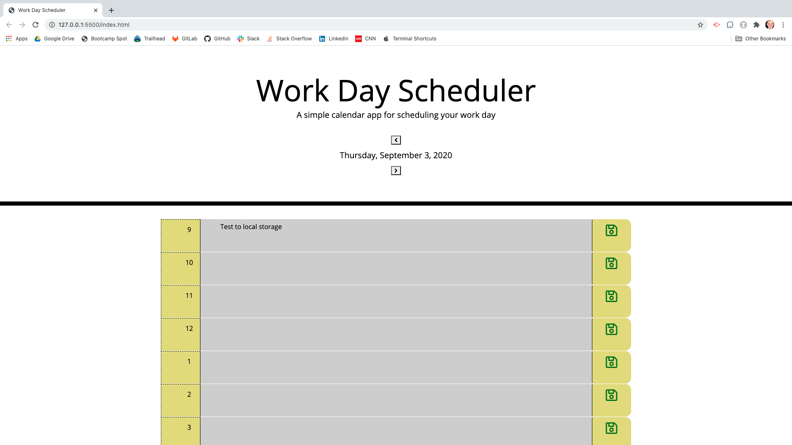

# workDaySchedular

[Github link](https://zacharybryan.github.io/workDayScheduler/)

## Description

This is a day schedular to help organize your day by filling in events and saving them to your local storage

### Table of Contents

* [Description](#description)
* [Usage](#usage)
* [Contributing](#contributing)
* [Questions](#questions)
* [License](#licence)

### Usage

To use this simply type in the event and click the save icon on the right and side of the page

### Contributing

- [Plover Brown](https://github.com/rebgrasshopper)
- [Kira Bismuth Lowrey](https://github.com/KILowrey)
- [Nancy Lambert-Brown](https://github.com/n-lambert)
- [Mando Estrada](https://github.com/Mando619)
- [Perry Theobald](https://github.com/perrytjr)
- [Jeneth Diestra](https://github.com/jen6one9)
- [Matthew Rogers](https://github.com/Rogers-Development-Services)
- [Jefrrey Choi](https://github.com/jepoy92)
- [Clyde Baron Rapinan](https://github.com/clydebaron2000)
- [Johnny Lieu](https://github.com/johnnylieu)
- [Robert Graham](https://github.com/Robmgraham)

### Questions

For any additional questions or update requests please contact me at zacharybryan@icloud.com

Find some of my other projects here!
[zacharybryan](https://www.github.com/zacharybryan)

### License

GNU General Public License v3.0

---
Copyright (c) 2020 Zachary Bryan
